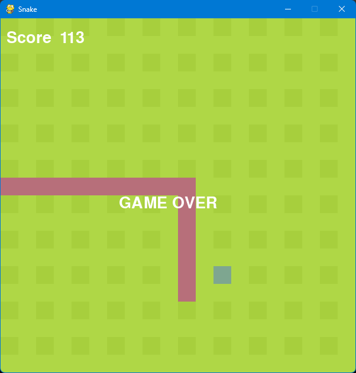

# 🐍 Snake Game

This Snake Game is developed using Python and The Pygame Library, offering a classic gaming experience with modern coding practices. The game features the traditional Snake gameplay, with additional features such as pause, score tracking, line clearing, level progression, collision detection, and background music to enhance the playing experience.

## ScreenShots



## 🚀 Features

- **Game Controls:** Simple and intuitive controls.
- **Levels:** The game speed increases as you progress, offering a challenging experience.
- **Score System:** Score tracking to keep track of your progress.
- **Pause/Resume:** Players can pause the game at any moment and resume where they left off.
- **Collision Detection:** Ensures a realistic gameplay experience.
- **Music and Sound Effects:** Enhances gameplay with engaging audio.

## 🎮 Gameplay

The objective is to place the eat more fruit to grow and gain points.
The game ends when the Snake colides with walls or bites itself.

## 🕹️ Controls

- **A** / **Left Arrow** : Move Snake Left
- **D** / **Right Arrow** : Move Snake Right
- **S** / **Down Arrow** : Move Snake Down
- **W** / **Up Arrow** : Move Snake Up
- **Space** : Pause/Resume Game
- **Enter** : Restart Game

## 🛠️ Installation

1. Clone the repository:

```bash
git clone https://github.com/djoezeke/snake.git
```

2. Navigate to the cloned directory:

```bash
   cd snake
```

3. Run the game:

```bash
python -m snake
```

## 📝 License

This project is licensed under the [MIT License](LICENSE).

## 🤝 Contributing

Contributions are welcome! If you have any ideas, suggestions, or bug reports, please open an issue or submit a pull request.

## 📞 Contact

For any questions or inquiries, feel free to open an issue.
